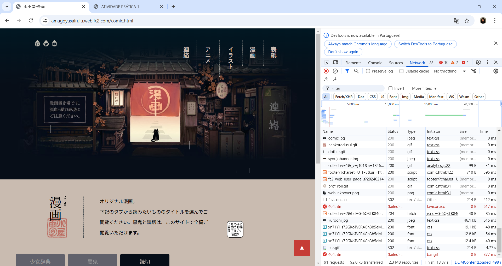

# Trabalho Prático - Semana-01

Abra o navegador, habilite as ferramentas de desenvolvedor, escolha a sessão rede (network) das ferramentas de desenvolvedor, acesse um site de um portal que você utiliza há muito tempo e verifique quantos arquivos são necessários para que a página seja montada.
✳️ Tire um print da tela com esses resultados da inspeção feita com as ferramentas do desenvolvedor e coloque o resultado em um arquivo de imagem.

Crie uma conta no Repl.it e monte uma página qualquer com um Hello World.
✳️ Tire um print da tela com a visualização da página e coloque o resultado em um arquivo de imagem.

## Informações Gerais
Nome: Lorrainny Camille Aparecida Gonçalves
Matricula: 880092

## Tela de inspeção com navegador

## Tela de projeto no Replit

